<div align="center">

# 🚀 ProspectPilot AI

### Multi-Agent Startup Intelligence Platform

**Agentic AI Platform for Startup Intelligence — built for founders, investors & analysts**

<br>

[](https://react.dev/)
[](https://nodejs.org/)
[](https://expressjs.com/)
[](https://www.mongodb.com/atlas)
[](https://ai.google.dev/)
[](https://jwt.io/)
[](https://tailwindcss.com/)
[](https://vercel.com/)
[]()
[](LICENSE)

<br>

[](https://git.io/typing-svg)

<br>

[**📖 About**](#-about-the-project) • [**✨ Features**](#-features) • [**🖼️ Screenshots**](#%EF%B8%8F-screenshots) • [**⚙️ Installation**](#%EF%B8%8F-installation-guide) • [**📡 API**](#-api-endpoints)

</div>

---

## 📖 About The Project

**ProspectPilot AI** is an **agentic AI platform** that replaces weeks of manual startup and market research with autonomous AI agents that do the digging for you.

> Traditional research is slow, scattered across spreadsheets, and surface-level. ProspectPilot deploys four specialized agents that pull from market data, competitor signals, funding databases, and startup metrics — then synthesize everything into a structured, decision-ready report in minutes.

### 🎯 The Problem

Founders, analysts, and investors waste days digging through scattered sources — news, SEC filings, competitor sites, market reports — just to answer simple questions like *"Is this market worth entering?"* or *"Is this startup fundable?"*

### 💡 The Solution

ProspectPilot AI gives you **four autonomous agents on one platform**, each purpose-built for a distinct intelligence domain:

| Agent | What it answers |
|:---|:---|
| 📊 **Market Research** | *How big is this market, and is it growing?* |
| 🕵️ **Competitor Analysis** | *Who am I really up against, and where are the gaps?* |
| 📈 **Startup Evaluation** | *Is this startup fundable — and how does it score?* |
| 💰 **Investment Intelligence** | *Where is capital flowing, and who's writing the checks?* |

### ⭐ Why It's Useful

- **🚀 10x faster** than manual research — minutes, not weeks
- **🧠 Zero prompt-engineering required** — just describe what you need in plain English
- **📚 Source-backed** — every insight is traceable, not a black-box guess
- **🌍 Broad coverage** — 50+ market verticals across 20+ geographies
- **📈 Built for real decisions** — outputs are structured for board decks and investment memos, not just casual reading
- **🔓 Accessible to everyone** — works equally well for a pre-seed founder validating an idea and a Series C investor doing diligence

### 👥 Who It's For

- **Founders** validating a new market or idea before building
- **Investors & analysts** screening deals and tracking competitive landscapes
- **Business strategists** who need fast, structured intelligence without a research team

---

## ✨ Features

<div align="center">

| 🚀 Feature | 📝 Description |
|:---|:---|
| 🔐 **Secure Authentication** | JWT-based register/login with bcrypt password hashing |
| 🧠 **Agentic AI Research** | Autonomous agents that plan, search, and synthesize — no prompt engineering needed |
| 📊 **Market Research Agent** | TAM/SAM/SOM sizing, trend signal detection, regulatory landscape mapping |
| 🕵️ **Competitor Analysis Agent** | Competitive moat scoring, funding round tracking, feature gap analysis |
| 📈 **Startup Evaluation Agent** | Scores startups across 40+ metrics on an A–F grading scale |
| 💰 **Investment Intelligence Agent** | Tracks $2T+ in deals across 3K+ investors for funding signals |
| 🗂️ **Saved Reports Dashboard** | Access and manage all previously generated AI reports |
| 🌍 **Global Market Coverage** | 50+ verticals across 20+ geographies with localized data sources |
| 🛡️ **Enterprise Security** | SOC 2 compliant — proprietary data never trains the models |
| 📱 **Responsive UI** | Sleek, mobile-friendly Tailwind CSS interface |

</div>

---

## 🖼️ Screenshots

<div align="center">

### 🏠 Landing Page
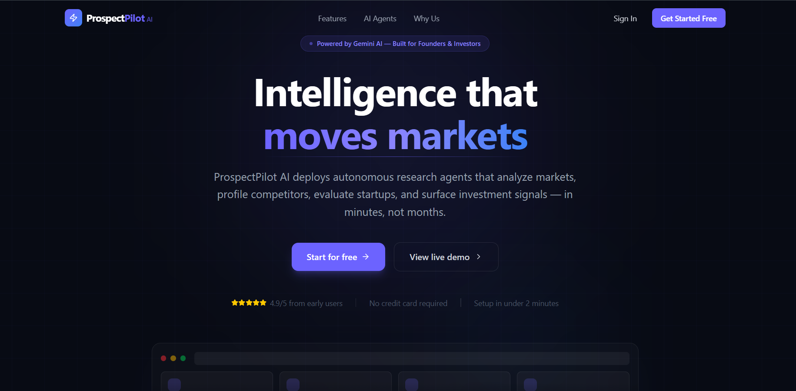

### ⚡ Platform Features
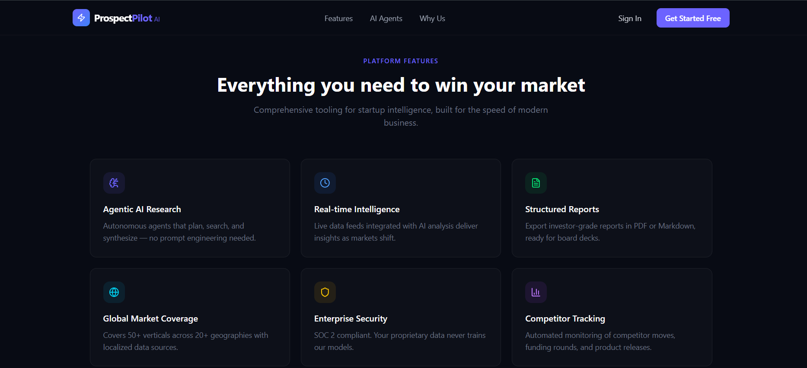

### 🤖 AI Agents Overview
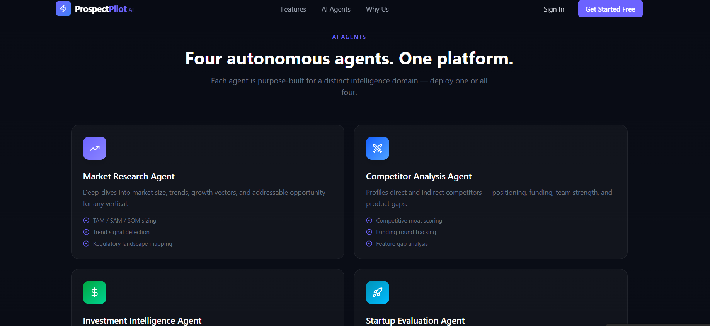

### 💡 Why ProspectPilot
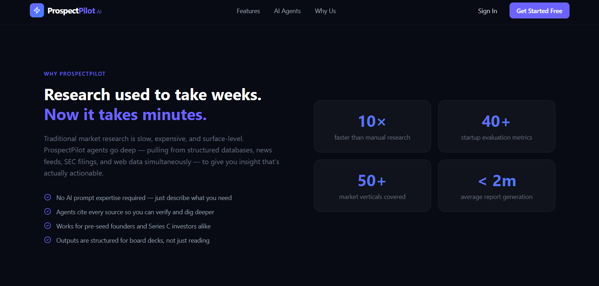

### 📣 Call to Action
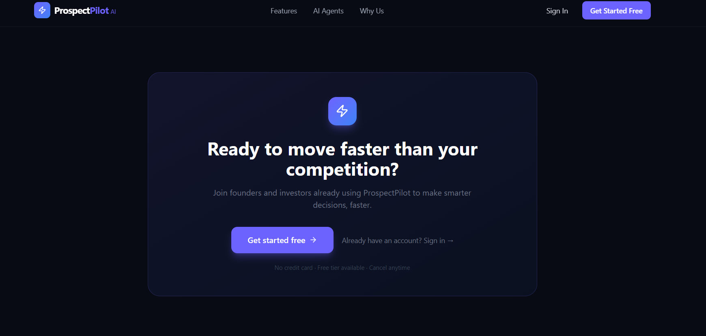

### 📝 Sign Up
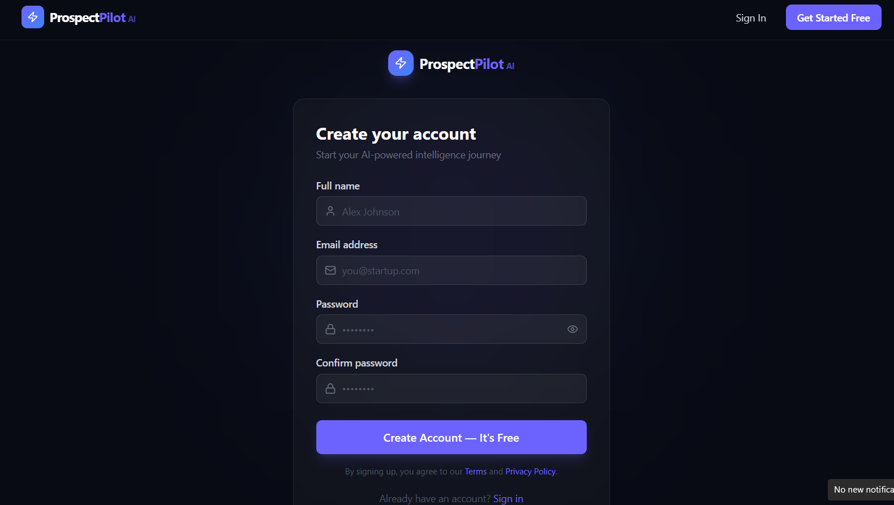

### 🔑 Sign In
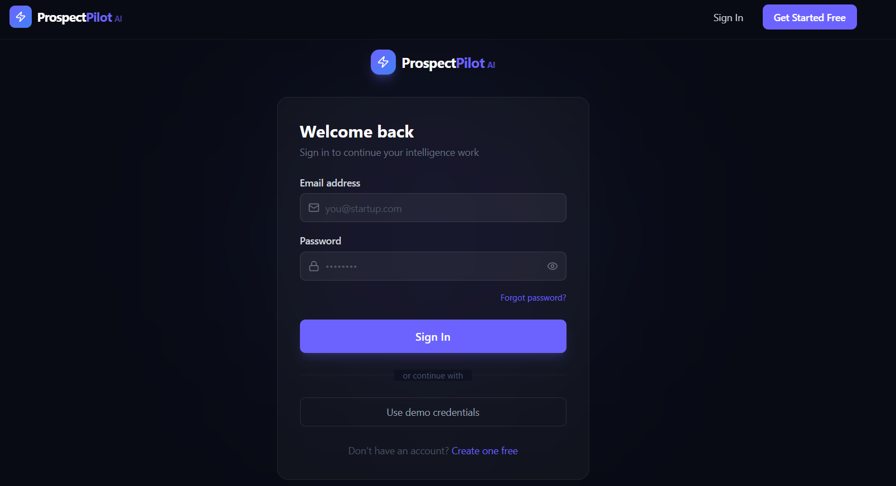

### 📊 Dashboard
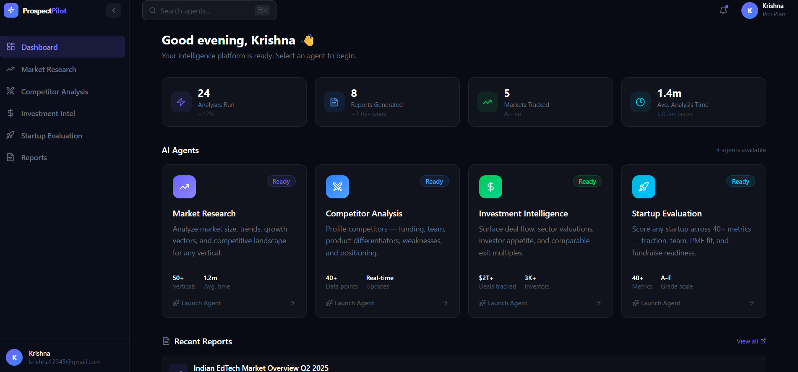

### 📈 Market Research Agent
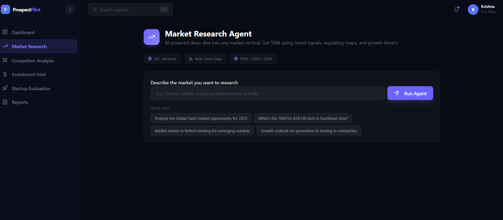

> 🕵️ **Competitor Analysis**, 💰 **Investment Intelligence**, and 🚀 **Startup Evaluation** agents share the same focused workspace layout shown above — just the agent icon, title, and quick-start prompts change per domain.

### 📂 Reports
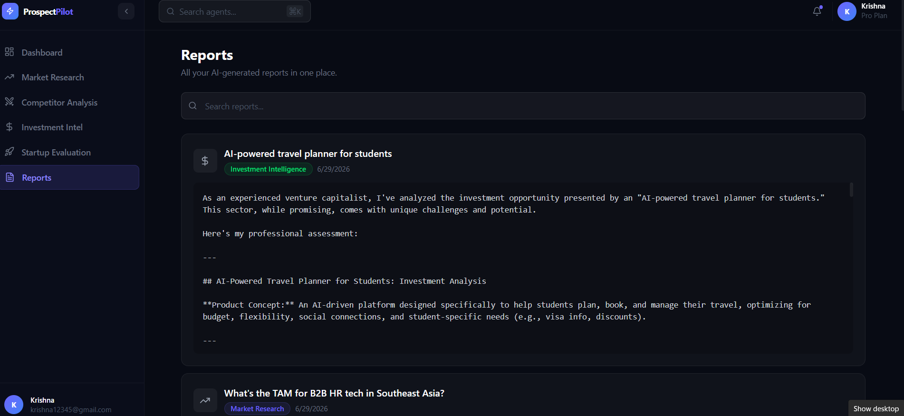

### 🦶 Footer
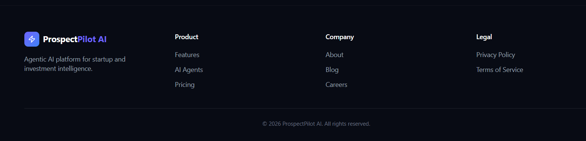

</div>

---

## 🔄 Workflow

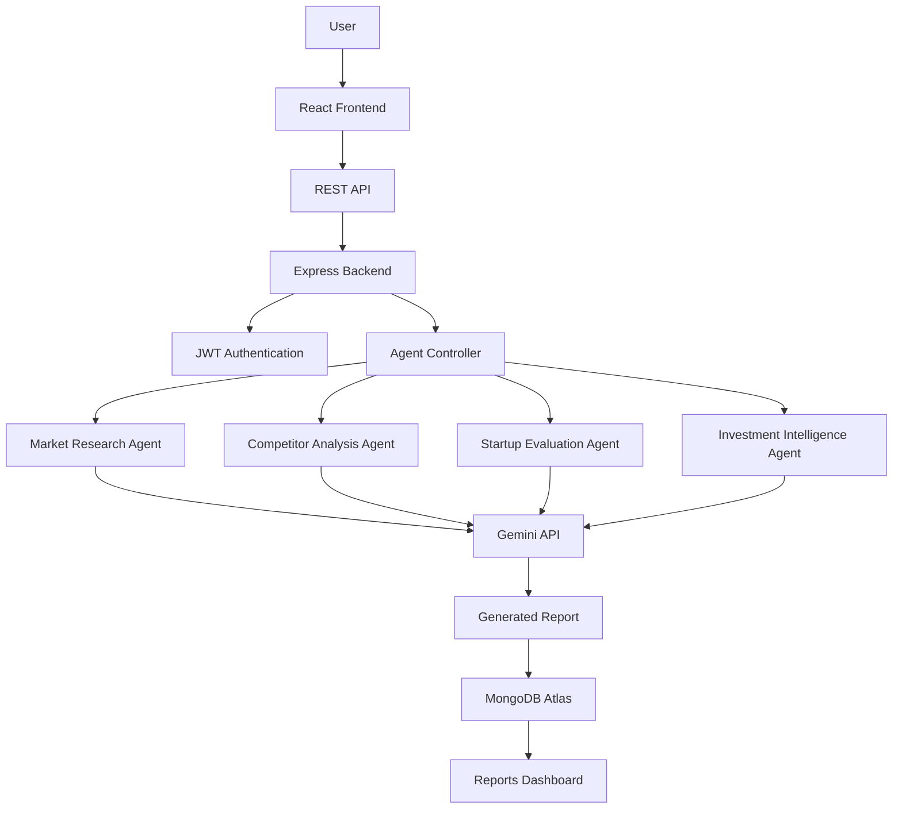

---

## 🧰 Tech Stack

<div align="center">

| Layer | Technologies |
|:---|:---|
| **Frontend** | React.js, Vite, Tailwind CSS, Axios, React Router, Lucide React |
| **Backend** | Node.js, Express.js, JWT Authentication, bcrypt.js |
| **Database** | MongoDB Atlas, Mongoose |
| **AI Engine** | Google Gemini 2.5 Flash API |
| **Deployment** | Vercel (Frontend), Render / Railway (Backend) |

</div>

---

## 📁 Folder Structure

```bash
ProspectPilotAI/
│
├── client/
│   ├── src/
│   ├── components/
│   ├── pages/
│   ├── services/
│   └── App.jsx
│
├── server/
│   ├── controllers/
│   ├── middleware/
│   ├── models/
│   ├── routes/
│   ├── config/
│   └── server.js
│
├── screenshots/
├── architecture/
└── README.md
```

---

## ⚙️ Installation Guide

### 1️⃣ Clone the repository

```bash
git clone https://github.com/<your-username>/ProspectPilotAI.git
cd ProspectPilotAI
```

### 2️⃣ Setup Frontend

```bash
cd client
npm install
npm run dev
```

### 3️⃣ Setup Backend

```bash
cd server
npm install
npm run dev
```

---

## 🔑 Environment Variables

Create a `.env` file inside the `server/` directory:

```env
PORT=
MONGO_URI=
JWT_SECRET=
GEMINI_API_KEY=
```

---

## 📡 API Endpoints

<div align="center">

| Method | Endpoint | Description |
|:---|:---|:---|
| `POST` | `/api/auth/register` | Register a new user |
| `POST` | `/api/auth/login` | Authenticate user & return JWT |
| `POST` | `/api/agents/market-research` | Run Market Research Agent |
| `POST` | `/api/agents/competitor-analysis` | Run Competitor Analysis Agent |
| `POST` | `/api/agents/startup-evaluation` | Run Startup Evaluation Agent |
| `POST` | `/api/agents/investment-intelligence` | Run Investment Intelligence Agent |
| `GET` | `/api/agents/reports` | Fetch all saved reports for a user |

</div>

---

<div align="center">

### Built with ❤️ using MERN Stack and Google Gemini AI

⭐ **If you found this project interesting, consider giving it a star!** ⭐

</div>
