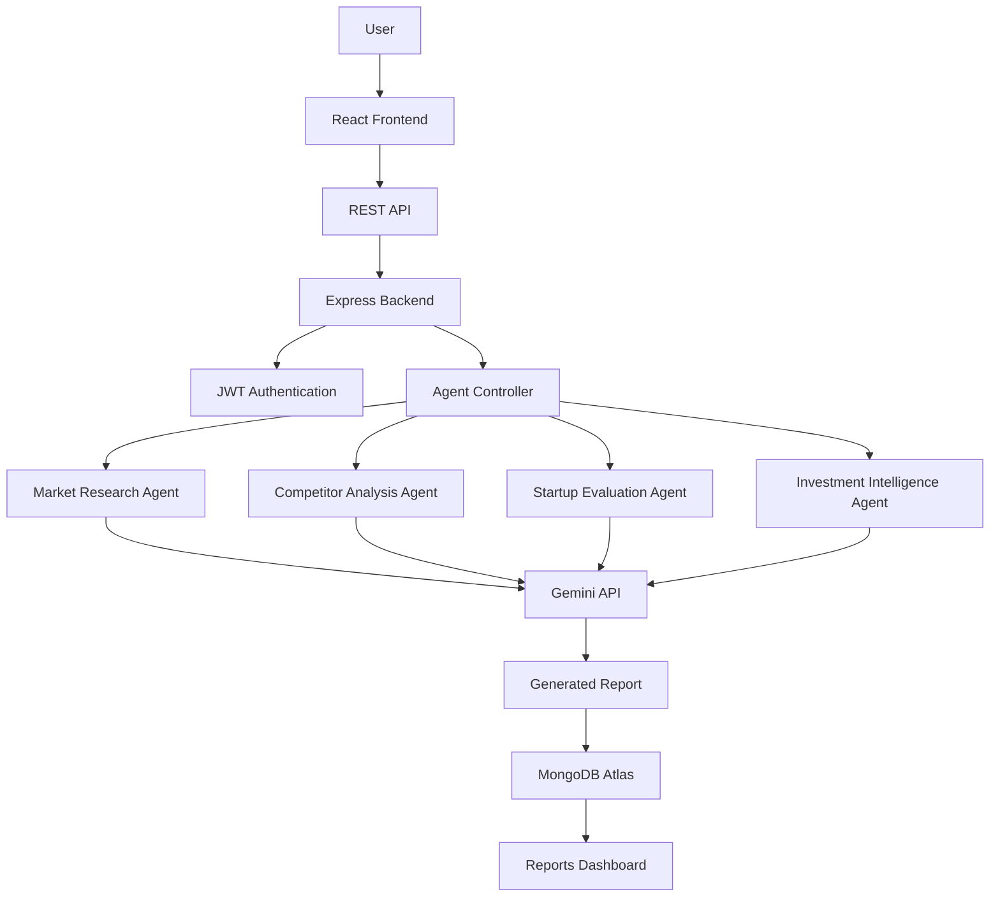

<div align="center">

# 🚀 ProspectPilot AI

### Multi-Agent Startup Intelligence Platform

**Agentic AI Platform for Startup Intelligence — built for founders, investors & analysts**

<br>

[](https://react.dev/)
[](https://nodejs.org/)
[](https://expressjs.com/)
[](https://www.mongodb.com/atlas)
[](https://ai.google.dev/)
[](https://jwt.io/)
[](https://tailwindcss.com/)
[](https://vercel.com/)
[]()
[](LICENSE)

<br>

[](https://git.io/typing-svg)

<br>

[**🎥 Demo**](#-demo) • [**✨ Features**](#-features) • [**🏗️ Architecture**](#%EF%B8%8F-system-architecture) • [**⚙️ Installation**](#%EF%B8%8F-installation-guide) • [**📡 API**](#-api-endpoints) • [**🤝 Contributing**](#-contributors)

</div>

---

## 🎥 Demo

<p align="center">
  
</p>

<p align="center"><i>📌 Replace <code>./assets/demo.gif</code> with your actual project demo recording.</i></p>

---

## ✨ Features

<div align="center">

| 🚀 Feature | 📝 Description |
|:---|:---|
| 🔐 **Secure Authentication** | JWT-based register/login with bcrypt password hashing |
| 🧠 **AI-Powered Startup Insights** | Gemini 2.5 Flash generates deep, structured startup intelligence |
| 📊 **Market Research Agent** | Analyzes market size, trends, and growth opportunities |
| 🕵️ **Competitor Analysis Agent** | Identifies key competitors, strengths, and gaps |
| 📈 **Startup Evaluation Agent** | Scores startup viability across key business dimensions |
| 💰 **Investment Intelligence Agent** | Surfaces funding signals and investment-readiness insights |
| 🗂️ **Saved Reports Dashboard** | Access and manage all previously generated AI reports |
| 🛡️ **JWT Protected Routes** | Role-secured backend APIs for authenticated access only |
| ☁️ **Cloud Database** | MongoDB Atlas for scalable, reliable data persistence |
| 📱 **Responsive UI** | Sleek, mobile-friendly Tailwind CSS interface |

</div>

---

## 🖼️ Screenshots

<div align="center">

### Dashboard


### Market Research Agent


### Competitor Analysis


### Startup Evaluation


### Investment Intelligence


### Reports Dashboard


</div>

> 📌 *Replace the image paths above with your actual screenshots inside the `/screenshots` directory.*

---

## 🏗️ System Architecture

<p align="center">
  
</p>

> ProspectPilot AI follows a **modular multi-agent architecture**, where independent AI agents communicate with the Gemini API and persist insights to MongoDB Atlas — enabling each agent (Market Research, Competitor Analysis, Startup Evaluation, Investment Intelligence) to operate, scale, and evolve independently.

---

## 🔄 Workflow



---

## 🧰 Tech Stack

<div align="center">

| Layer | Technologies |
|:---|:---|
| **Frontend** | React.js, Vite, Tailwind CSS, Axios, React Router, Lucide React |
| **Backend** | Node.js, Express.js, JWT Authentication, bcrypt.js |
| **Database** | MongoDB Atlas, Mongoose |
| **AI Engine** | Google Gemini 2.5 Flash API |
| **Deployment** | Vercel (Frontend), Render / Railway (Backend) |

</div>

---

## 📁 Folder Structure

```bash
ProspectPilotAI/
│
├── client/
│   ├── src/
│   ├── components/
│   ├── pages/
│   ├── services/
│   └── App.jsx
│
├── server/
│   ├── controllers/
│   ├── middleware/
│   ├── models/
│   ├── routes/
│   ├── config/
│   └── server.js
│
├── screenshots/
├── architecture/
└── README.md
```

---

## ⚙️ Installation Guide

### 1️⃣ Clone the repository

```bash
git clone https://github.com/<your-username>/ProspectPilotAI.git
cd ProspectPilotAI
```

### 2️⃣ Setup Frontend

```bash
cd client
npm install
npm run dev
```

### 3️⃣ Setup Backend

```bash
cd server
npm install
npm run dev
```

---

## 🔑 Environment Variables

Create a `.env` file inside the `server/` directory:

```env
PORT=
MONGO_URI=
JWT_SECRET=
GEMINI_API_KEY=
```

---

## 📡 API Endpoints

<div align="center">

| Method | Endpoint | Description |
|:---|:---|:---|
| `POST` | `/api/auth/register` | Register a new user |
| `POST` | `/api/auth/login` | Authenticate user & return JWT |
| `POST` | `/api/agents/market-research` | Run Market Research Agent |
| `POST` | `/api/agents/competitor-analysis` | Run Competitor Analysis Agent |
| `POST` | `/api/agents/startup-evaluation` | Run Startup Evaluation Agent |
| `POST` | `/api/agents/investment-intelligence` | Run Investment Intelligence Agent |
| `GET` | `/api/agents/reports` | Fetch all saved reports for a user |

</div>

---

## 🔮 Future Enhancements

- 📄 PDF Export of AI-generated reports
- 🤖 Multi-LLM Support (OpenAI, Claude, Mistral)
- 📡 Real-Time Market Data Integration
- 🎙️ Voice-Based Interaction
- 📚 RAG (Retrieval-Augmented Generation) Integration
- 👥 Team Collaboration Workspaces
- 📊 Analytics Dashboard with Trend Insights

---

## 🤝 Contributors

<div align="center">

<table>
  <tr>
    <td align="center">
      <a href="https://github.com/<username>">
        .png" width="80" height="80" style="border-radius:50%"><br>
        <sub><b>Your Name</b></sub>
      </a><br>
      <sub>Founder & Lead Developer</sub>
    </td>
    <td align="center">
      <a href="https://github.com/<username2>">
        .png" width="80" height="80" style="border-radius:50%"><br>
        <sub><b>Teammate Name</b></sub>
      </a><br>
      <sub>Contributor</sub>
    </td>
  </tr>
</table>

*Want to contribute? Pull requests are warmly welcome!* 🎉

</div>

---

## 📄 License

This project is licensed under the **MIT License** — see the [LICENSE](LICENSE) file for details.

---

<div align="center">

### Built with ❤️ using MERN Stack and Google Gemini AI

⭐ **If you found this project interesting, consider giving it a star!** ⭐

</div>
